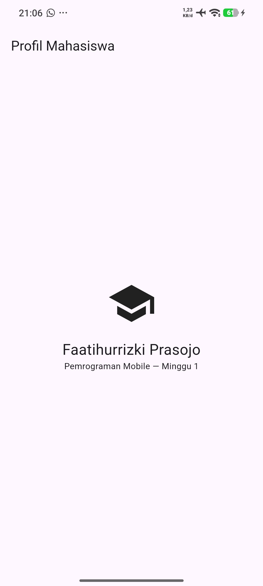
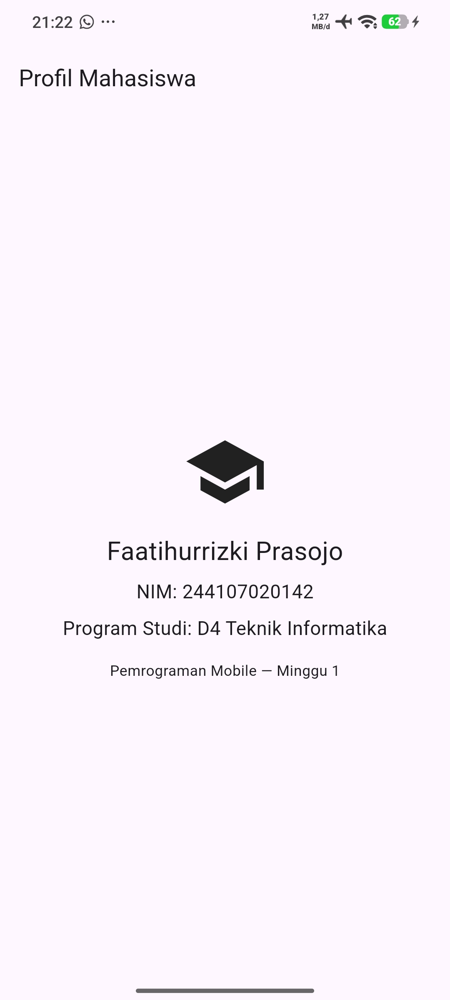

# Tugas Praktikum Minggu 1: Profil Mahasiswa

**Nama:** Faatihurrizki Prasojo

**NIM:** 244107020142

## Kendala Setup yang Ditemui
Selama proses instalasi dan menjalankan aplikasi pertama kali, saya menemui dua kendala utama:
1. **Gradle Build timeout:** Terjadi error `Timeout waiting to lock build logic queue`. Solusinya adalah dengan menghentikan proses Gradle yang berjalan di latar belakang atau menghapus file `buildLogic.lock`.
2. **Android NDK Corrupt:** Muncul pesan error `NDK did not have a source.properties file`. Kendala ini diselesaikan dengan menghapus folder NDK versi tersebut di `%localappdata%\Android\sdk\ndk` agar sistem Flutter/Gradle mengunduh ulang file NDK yang utuh dan benar secara otomatis. Selain itu, diperlukan pengaturan "Install via USB" pada Developer Options HP Xiaomi agar aplikasi bisa diinstal.

## Screenshot Hasil
Hasil Awal

Mini Assignment
