# Tugas Praktikum Minggu 2: Responsive Dashboard
---
**Nama:** Faatihurrizki Prasojo

**NIM:** 244107020142

---
### Widget dasar
- `StatelessWidget` cocok untuk UI yang output-nya ditentukan oleh konfigurasi dari parent.
- `StatefulWidget` memiliki objek State untuk data yang dapat berubah selama lifecycle.
- `Container` menggabungkan ukuran, padding, margin, decoration, dan child.
- `Row` menyusun child secara horizontal, sedangkan Column secara vertikal.
- `Expanded` membagi ruang yang tersedia di dalam Row atau Column.

---
### Praktikum : Layout Sederhana (Warm-up)
#### Tujuan
- Memahami Penggunaan `Expanded` pada `Row`: Mengetahui bagaimana widget `Expanded` mendistribusikan ruang yang tersedia secara fleksibel. 
- Memahami Pengaturan Ukuran (`mainAxisSize`): Perbedaan antara `MainAxisSize.min` (membuat tinggi/lebar kontainer menyesuaikan isi di dalamnya) dengan nilai defaultnya, yaitu `MainAxisSize.max` (membuat kontainer memenuhi ruang vertikal yang tersedia di induknya).
- Komposisi Widget Dasar: `Container`, `Column`, `Row`, `CircleAvatar`, dan `Text` untuk membangun antarmuka pengguna yang terstruktur rapi.

#### Eksperimen & Dokumentasi
| Hasil Awal | Hapus `Expanded` pada baris nama |
| :---: | :---: | 
| 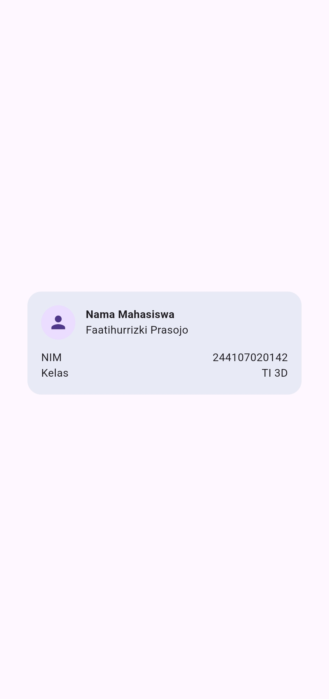 |  |

| Ganti `mainAxisSize: MainAxisSize.min` menjadi nilai default  | Tambahkan satu baris data |
| :---: | :---: | 
| 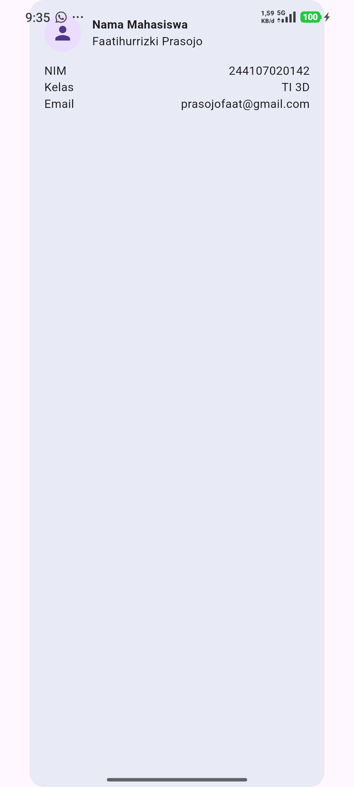 | 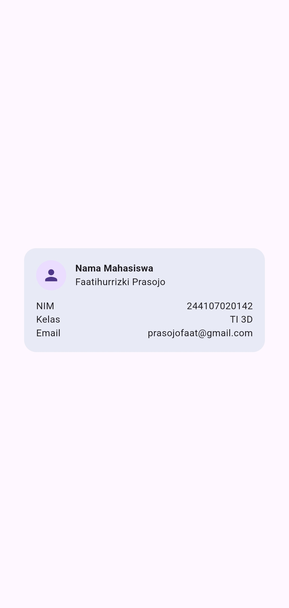 |

---
### Praktikum: Dashboard Responsif

#### Tujuan
- Memanfaatkan widget `LayoutBuilder` dan `GridView.count` untuk mengatur jumlah kolom secara dinamis berdasarkan lebar layar
- Mengubah widget dari `StatelessWidget` menjadi `StatefulWidget` guna menyimpan dan mengontrol status aktif aplikasi, seperti pengaturan mode tema terang atau gelap
- Mengenal dan mempraktikkan penggunaan `CupertinoSwitch` (gaya iOS) di dalam aplikasi berbasis Material Design, serta memahami cara meneruskan fungsi callback antar-widget.
- Memahami pentingnya penambahan label `Semantics` agar elemen penting pada antarmuka dapat dibaca dengan baik oleh screen reader

#### Dokumentasi
|  Light Mode| Dark Mode  |
| :---: | :---: | 
| 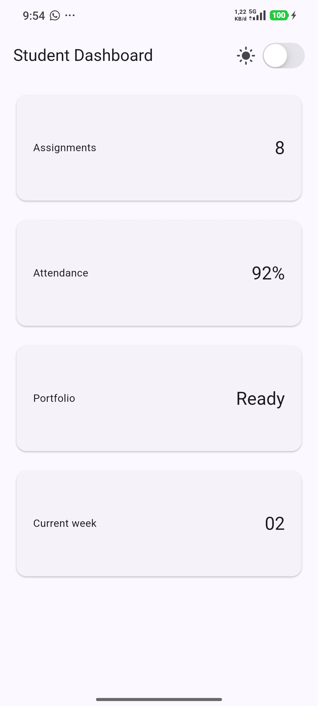 | 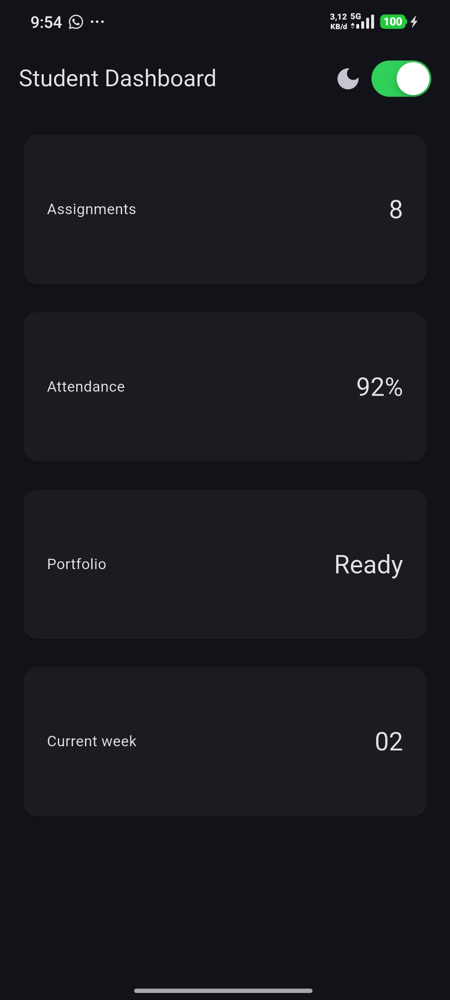 |

| Layar Lebar|
| :---: |  
| 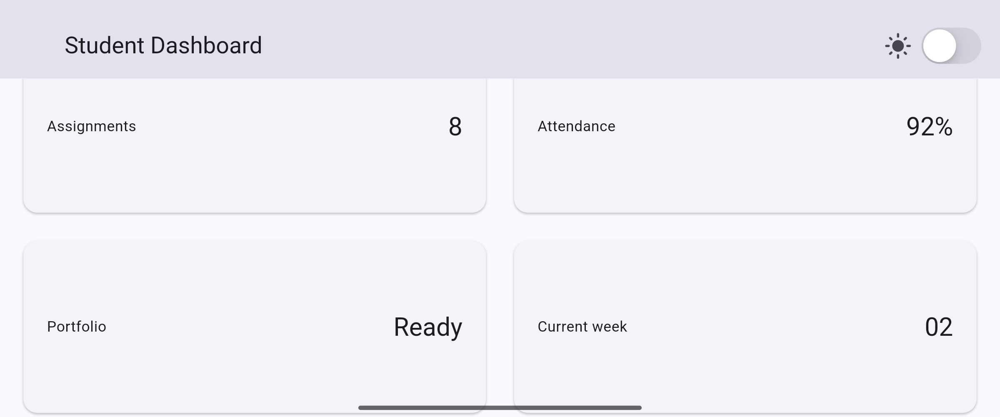 |

---
### Tugas dan AI design exploration
#### Dokumentasi Tugas Utama 
|  Light Mode| Dark Mode  |
| :---: | :---: | 
| 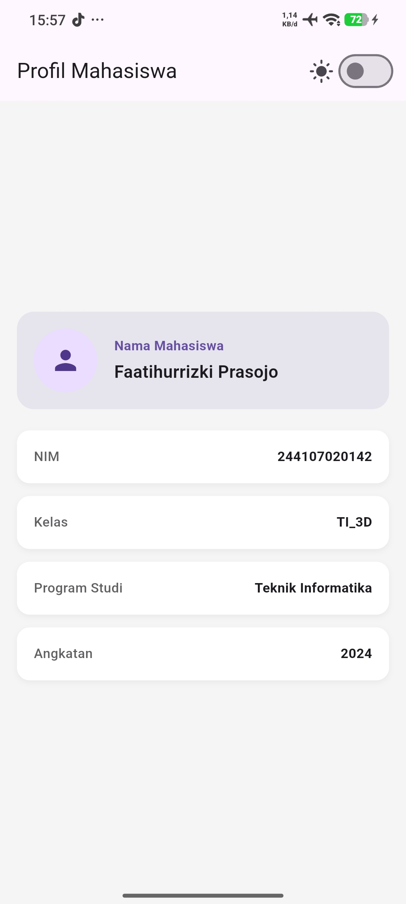 | 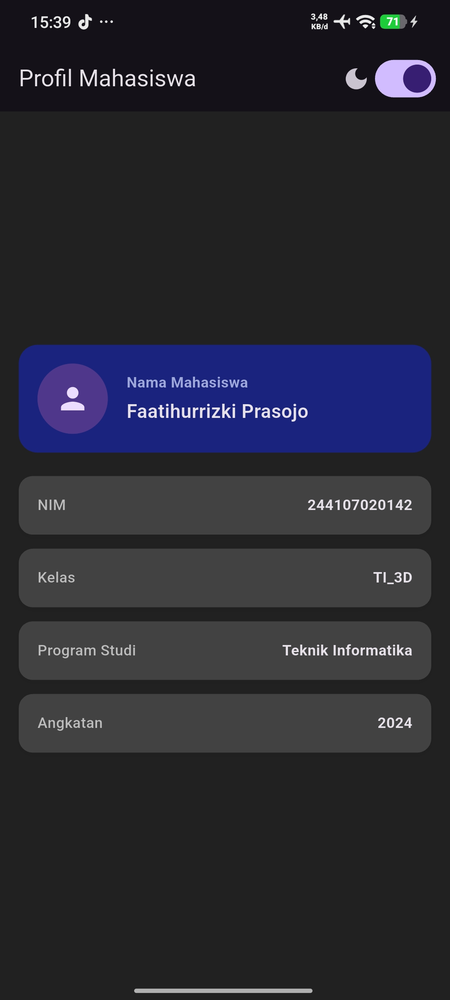 |

| Layar Lebar ( 2 kolom )|
| :---: |  
| 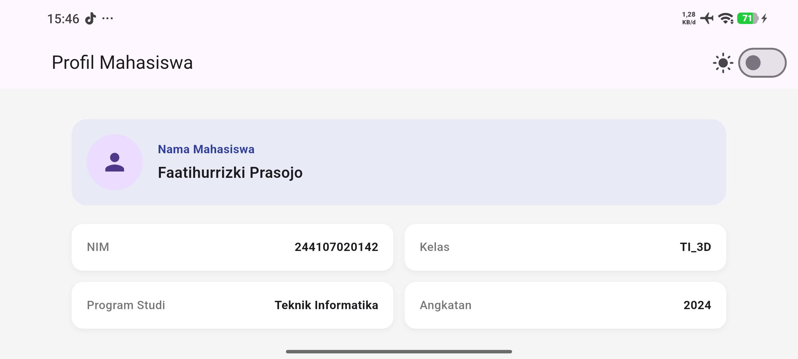 |


#### AI Prompt Challenge

1. Bandingkan dua tata letak dashboard akademik untuk Flutter: versi GridView dan versi LayoutBuilder + Column. Jelaskan trade-off responsif dan aksesibilitasnya

| Fitur / Parameter | Pendekatan GridView (`GridView.count` / `extent`) | Pendekatan LayoutBuilder + Column + Row |
| :--- | :--- | :--- |
| **Fleksibilitas Item** | Cenderung kaku (tinggi item seragam kecuali diatur menggunakan child aspect ratio kustom). | Sangat fleksibel (tinggi dan lebar setiap komponen dapat menyesuaikan konten secara alami). |
| **Kompleksitas Kode** | Ringkas dan deklaratif untuk jumlah kolom tetap atau berbasis ukuran minimum (`maxCrossAxisExtent`). | Cukup panjang karena memerlukan logika kondisional eksplisit (`if`, `LayoutBuilder`) untuk menyusun baris dan kolom. |
| **Pengelolaan Scroll** | Umumnya menyatu dengan scroll utama layar atau memerlukan pengaturan `shrinkWrap: true` dan `physics: NeverScrollableScrollPhysics` jika di dalam Column. | Mengandalkan `SingleChildScrollView` eksternal sehingga seluruh halaman bergulir sebagai satu kesatuan yang mulus. |


**Trade-off Responsivitas**
- GridView:
    - Kelebihan : Otomatis menyesuaikan jumlah kolom berdasarkan lebar layar tanpa logika tambahan.
    - Kekurangan : Kaku terhadap variasi tinggi konten; elemen dalam satu baris dipaksa memiliki tinggi yang sama sehingga berisiko overflow atau menyisakan ruang kosong.
- LayoutBuilder + Column:
    - Kelebihan: Kontrol breakpoint layar sangat presisi (misal: membagi 1 atau 2 kolom secara kondisional) dan sangat aman untuk konten dengan tinggi dinamis.
    - Kekurangan: Membutuhkan lebih banyak boilerplate dan perhitungan manual untuk menyusun elemen secara dinamis.

**Trade-off Aksesibilitas (Accessibility / a11y)**
- Urutan Fokus Pembaca Layar (Screen Reader Order):

    - GridView: Dibaca berdasar indeks grid (kiri ke kanan), namun sulit dikustomisasi jika butuh prioritas baca khusus di luar struktur grid standar.

    - LayoutBuilder + Column: Navigasi fokus lebih natural dan fleksibel karena mengikuti hierarki pohon kode (tree structure).

- Trade-off Aksesibilitas (a11y) :

    - GridView: Rwan mengalami RenderFlex overflow saat font diperbesar karena tinggi grid dibatasi rasio tetap.

    - LayoutBuilder + Column: Lebih aman dan adaptif karena wadah komponen dapat berekspansi secara vertikal mengikuti ukuran teks.

2. Jelaskan kapan penggunaan Expanded justru menyebabkan overflow di dalam Row, beri contoh kode yang gagal dan perbaikannya.

    Penggunaan `Expanded` di dalam `Row` yang berada pada wadah dengan lebar tidak terbatas (unbounded width—seperti `SingleChildScrollView` horizontal) akan memicu runtime exception (lebar tak berhingga). Masalah ini terjadi karena `Expanded` memaksa komponen anak mengisi seluruh sisa ruang, padahal wadah tersebut tidak memberikan batasan ukuran horizontal yang pasti.

- Contoh kode gagal
```
import 'package:flutter/material.dart';

class FailingExample extends StatelessWidget {
  const FailingExample({super.key});

  @override
  Widget build(BuildContext context) {
    return SingleChildScrollView(
      scrollDirection: Axis.horizontal,
      child: Row(
        children: [
          const Text('Status: '),
          Expanded(
            child: Text(
              'Ini adalah teks informasi yang sangat panjang dan membutuhkan ruang fleksibel.',
            ),
          ),
        ],
      ),
    );
  }
}
```


- Contoh kode benar
```
import 'package:flutter/material.dart';

class FixedExample extends StatelessWidget {
  const FixedExample({super.key});

  @override
  Widget build(BuildContext context) {
    return SingleChildScrollView(
      scrollDirection: Axis.horizontal,
      child: Row(
        children: [
          const Text('Status: '),
          SizedBox(
            width: 250, // Memberikan batas lebar yang pasti (bounded width)
            child: Text(
              'Ini adalah teks informasi yang sangat panjang dan membutuhkan ruang fleksibel.',
              overflow: TextOverflow.ellipsis,
            ),
          ),
        ],
      ),
    );
  }
}
```
3. apakah tetap responsif di bawah 600px, apakah mengurangi aksesibilitas, dan apakah ada widget yang tidak tersedia di Flutter stabil saat ini?
- Responsivitas (<600px): Tetap responsif karena menggunakan breakpoint `maxWidth > 500` yang otomatis mengubah tampilan 2 kolom menjadi 1 kolom vertikal, serta dilengkapi `SingleChildScrollView` dan `ConstrainedBox` untuk mencegah overflow.

- Aksesibilitas (a11y): Justru meningkat karena mempertahankan label Semantics dan menggunakan `Switch.adaptive` agar interaksi tombol tema sesuai standar platform masing-masing.

- Ketersediaan Widget: Aman digunakan karena seluruh komponen (`LayoutBuilder`, `SingleChildScrollView`, `ConstrainedBox`, `Semantics`, `Switch.adaptive`, dan `CircleAvatar`) merupakan bagian dari Flutter SDK stabil tanpa butuh paket pihak ketiga.


#### Dokumentasi Refactoring Challenge
|  Light Mode| Dark Mode  |
| :---: | :---: | 
| 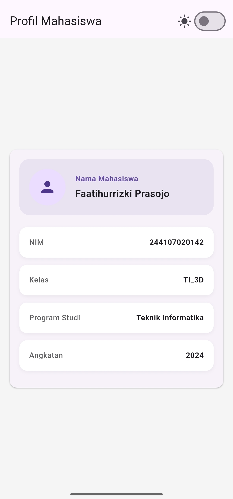 | 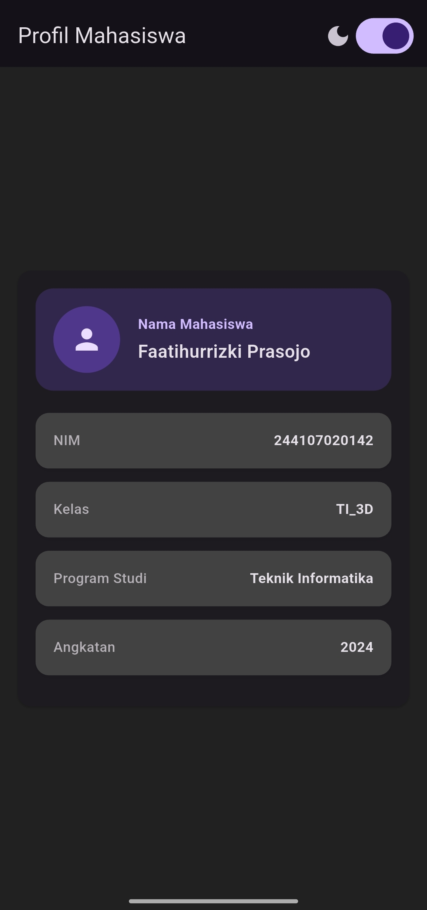 |

| Layar Lebar ( 2 kolom )|
| :---: |  
| 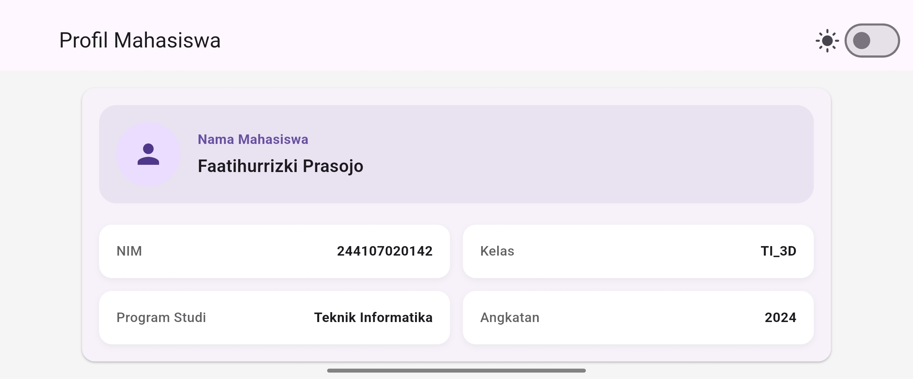 |

| flutter analyze & flutter test |
| :---: |  
| 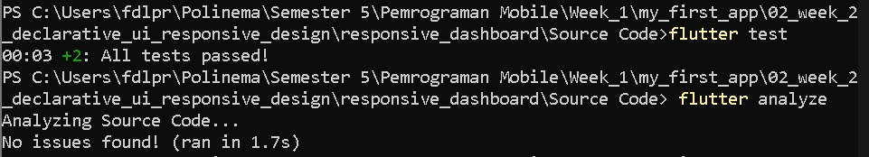 |

---

### Refleksi 
- Apa perbedaan cara berpikir imperative dan declarative saat membangun UI?
    - Imperatif: Mengontrol UI secara manual langkah demi langkah untuk mengubah status elemen tampilan.

    - Deklaratif: Mendeskripsikan bentuk tampilan berdasarkan state, di mana framework (seperti Flutter) otomatis memperbarui (rebuild) UI saat kondisi data berubah.

- Kapan Expanded membantu dan kapan penggunaannya justru menghasilkan layout error?
    - Saat di dalam kontainer berukuran pasti (bounded seperti Row, Column, atau Flex) untuk memaksa widget mengisi sisa ruang.

    - Error: Saat ditempatkan di kontainer tanpa batas, karena widget ini memerlukan kejelasan batas ruang sisa.
- Bagaimana breakpoint dan theme memengaruhi pengalaman pengguna?
    - Breakpoint: Membuat tata letak beradaptasi dari layar sempit (ponsel) ke layar luas (desktop) secara responsif.

    - Theme: Menjaga kenyamanan mata, keterbacaan teks, dan standar kontras warna melalui mode terang serta gelap.

- Apa yang Anda verifikasi dari rekomendasi AI setelah tugas inti selesai?
    - Memverifikasi responsivitas layout, aksesibilitas (label semantics dan skala font), serta kualitas kode (menghindari fungsi usang seperti withOpacity yang diganti withValues, serta lolos uji analisis statis dan testing). 