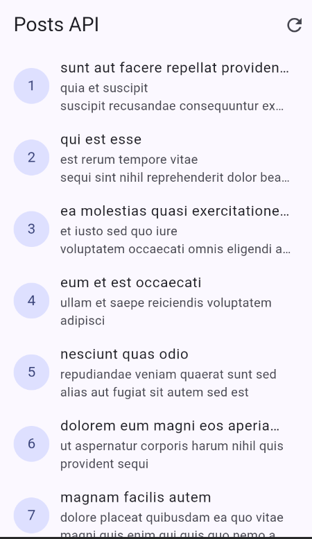
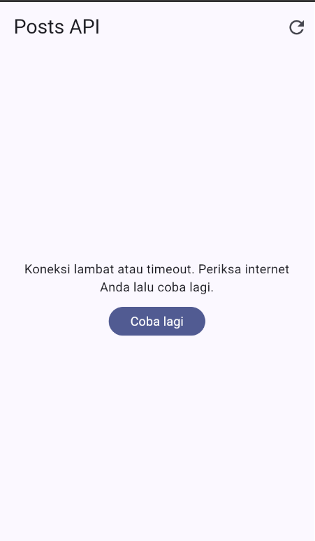
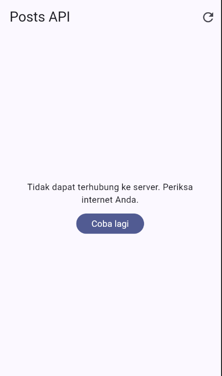

# Minggu 4 - Networking Rest API

**Nama:** Faatihurrizki Prasojo

**NIM:** 244107020142

## Tujuan 
- Menjelaskan konsep HTTP, REST API, dan JSON;
- Memetakan JSON ke model Dart (serialization) dengan aman null;
- Menerapkan repository pattern dasar sehingga UI tidak memanggil API secara langsung;
- Mengonfigurasi Dio (base URL, timeout, interceptor) dan menangani error jaringan;
- Menampilkan state loading, error, empty, dan success pada UI dengan AsyncValue + Riverpod;
- Menerapkan pagination dasar (infinite scroll).

#### HTTP dan REST API

| Method | Makna pada koleksi resource | Contoh |
| :--- | :--- | :--- |
| GET | Membaca data (tanpa efek samping). | `GET /posts` , `GET /posts/1` |;
| POST | Membuat resource baru. | `POST /posts` |
| PUT / PATCH | Mengganti / memperbarui sebagian resource. | `PUT /posts/1` |
| DELETE | Menghapus resource. | `DELETE /posts/1` |

#### JSON dan model Dart
JSON (JavaScript Object Notation) adalah format tukar data standar API. Contoh respons `GET https://jsonplaceholder.typicode.com/posts/1`:

```
{
  "userId": 1,
  "id": 1,
  "title": "sunt aut facere...",
  "body": "quia et suscipit..."
}
```
Di Dart, JSON mentah (`Map<String, dynamic>`) harus dipetakan ke class model agar aman terhadap null dan kesalahan ketik. Pola manual `fromJson`/`toJson` cukup untuk codelab ini; untuk project besar gunakan code generator (`json_serializable` / `freezed`).


## Dokumentasi Provider dan error handling
| Home | No Internet | baseUrl Salah |
| :---: | :---: |:---: |
|  |  |  |


## Dokumentasi AI Challenge
| Gemini AI | 
| :---: | 
|  |

Model: Comment (`lib/data/models/comment.dart`)

```
class Comment {
  final int postId;
  final int id;
  final String name;
  final String email;
  final String body;

  Comment({
    required this.postId,
    required this.id,
    required this.name,
    required this.email,
    required this.body,
  });

  factory Comment.fromJson(Map<String, dynamic> json) {
    int parseInt(dynamic value) {
      if (value is num) return value.toInt();
      if (value is String) return int.tryParse(value) ?? 0;
      return 0;
    }

    String parseString(dynamic value) {
      if (value is String) return value;
      return value?.toString() ?? '';
    }

    return Comment(
      postId: parseInt(json['postId']),
      id: parseInt(json['id']),
      name: parseString(json['name']),
      email: parseString(json['email']),
      body: parseString(json['body']),
    );
  }
}
```

Repository: `CommentRepository` (`lib/data/repositories/comment_repository.dart`)
```
import 'package:dio/dio.dart';
import '../models/comment.dart';

class CommentRepository {
  final Dio _dio;

  // Menerima dependency Dio melalui constructor
  CommentRepository(this._dio);

  // Method untuk mengambil daftar komentar berdasarkan postId
  Future<List<Comment>> fetchComments(int postId) async {
    final response = await _dio.get<List>(
      '/comments',
      queryParameters: {'postId': postId},
      // Mengatur opsi timeout khusus untuk request ini selama 10 detik
      options: Options(
        sendTimeout: const Duration(seconds: 10),
        receiveTimeout: const Duration(seconds: 10),
      ),
    );

    final data = response.data ?? [];

    // Mapping response data JSON menjadi List<Comment>
    return data
        .whereType<Map<String, dynamic>>()
        .map(Comment.fromJson)
        .toList();
  }
}
```

Error Helper & Providers (`lib/data/providers/comment_providers.dart`)
```
import 'package:dio/dio.dart';
import 'package:flutter_riverpod/flutter_riverpod.dart';
import '../models/comment.dart';
import '../repositories/comment_repository.dart';

final dioProvider = Provider<Dio>((ref) {
  return Dio(
    BaseOptions(
      baseUrl: 'https://jsonplaceholder.typicode.com',
      connectTimeout: const Duration(seconds: 10),
    ),
  );
});

final commentRepositoryProvider = Provider<CommentRepository>((ref) {
  return CommentRepository(ref.watch(dioProvider));
});

String getFriendlyErrorMessage(Object error) {
  if (error is DioException) {
    switch (error.type) {
      case DioExceptionType.connectionTimeout:
      case DioExceptionType.sendTimeout:
      case DioExceptionType.receiveTimeout:
        return 'Koneksi lambat. Silakan periksa jaringan Anda dan coba lagi.';
      case DioExceptionType.connectionError:
        return 'Gagal terhubung ke server. Pastikan koneksi internet Anda aktif.';
      case DioExceptionType.badResponse:
        final statusCode = error.response?.statusCode;
        if (statusCode == 404) {
          return 'Data komentar tidak ditemukan (404).';
        } else if (statusCode == 500) {
          return 'Terjadi masalah pada server (500). Silakan coba lagi nanti.';
        }
        return 'Terjadi kesalahan pada server ($statusCode).';
      default:
        return 'Terjadi kesalahan jaringan yang tidak terduga.';
    }
  }
  return 'Terjadi kesalahan: ${error.toString()}';
}

final commentListProvider =
    FutureProvider.family<List<Comment>, int>((ref, postId) async {
  final repo = ref.watch(commentRepositoryProvider);
  return repo.fetchComments(postId);
});
```

Unit Test: `Comment.fromJson` (`test/comment_test.dart`)
```
import 'package:flutter_test/flutter_test.dart';
import 'package:week_4_networking_rest_api/data/models/comment.dart';

void main() {
  group('Comment Model Test', () {
    test('fromJson harus mengembalikan instance Comment dengan nilai default saat field hilang/null', () {
      final Map<String, dynamic> incompleteJson = {
        'id': 10,
        'name': 'John Doe',
      };

      final comment = Comment.fromJson(incompleteJson);

      expect(comment.id, equals(10));
      expect(comment.name, equals('John Doe'));
      expect(comment.postId, equals(0));
      expect(comment.email, equals(''));
      expect(comment.body, equals(''));
    });

    test('Edge Case: fromJson harus menangani objek JSON yang seluruh nilainya null/salah tipe', () {
      final Map<String, dynamic> corruptedJson = {
        'postId': null,
        'id': 'bukan_angka',
        'name': null,
        'email': 12345, // Mengkonversi angka 12345 menjadi string '12345'
        'body': null,
      };

      final comment = Comment.fromJson(corruptedJson);

      expect(comment.postId, equals(0));
      expect(comment.id, equals(0));
      expect(comment.name, equals(''));
      expect(comment.email, equals('12345')); // Ubah dari '' menjadi '12345'
      expect(comment.body, equals(''));
    });
  });
}
```

## Dokumentasi Refactoring dan testing

| Page - 1 | Page - 2 |
| :---: | :---: |
|  |  |

| Testing | 
| :---: | 
|  |


## Refleksi
 - `setState` vs Riverpod: Gunakan `setState` untuk state lokal widget tunggal yang sederhana. Naik ke Riverpod saat state perlu dibagi ke banyak widget atau diakses secara global.

- `context.go` vs `context.push`: `context.go` menggantikan rute saat ini (untuk navigasi utama seperti menu bawah), sedangkan `context.push` menumpuk rute baru di atasnya (untuk halaman detail yang butuh tombol kembali).

- Keunggulan `AsyncValue`: Mencegah bug inkonsistensi state (misal `isLoading` dan `hasError` aktif bersamaan) karena menggabungkan status loading, error, dan data ke dalam satu objek yang mutually exclusive.

- Perbaikan pada Hasil AI: Memperbaiki penamaan widget navigasi (`NavigationDestination`), menghapus blok `default` yang redundan pada switch, serta menyesuaikan pumpAndSettle pada widget test agar animasi dialog tertutup selesai dengan sempurna.